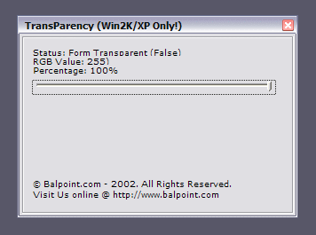



## BalPoint Transparency

### Description

This code module makes all objects (including forms) with Hwnd. transparent! it only works on Windows XP/2K. Uses the User32.dll from those operating systems.
 
### More Info
 
Function:

MakeTransparent Me.Hwnd,200

(200 is a RGB value. From 1 to 255. The lower the nomber the more transparent the form gets!)

Transparency!

None Known...

             |
---                |---
**Submitted On**   |2001-08-12 15:25:46
**By**             |[darklordz](https://github.com/Planet-Source-Code/PSCIndex/blob/master/ByAuthor/darklordz.md)
**Level**          |Intermediate
**User Rating**    |4.8 (24 globes from 5 users)
**Compatibility**  |VB 5\.0, VB 6\.0
**Category**       |[VB function enhancement](https://github.com/Planet-Source-Code/PSCIndex/blob/master/ByCategory/vb-function-enhancement__1-25.md)
**World**          |[Visual Basic](https://github.com/Planet-Source-Code/PSCIndex/blob/master/ByWorld/visual-basic.md)
**Archive File**   |[BalPoint\_T1491171132002\.zip](https://github.com/Planet-Source-Code/darklordz-balpoint-transparency__1-40365/archive/master.zip)

